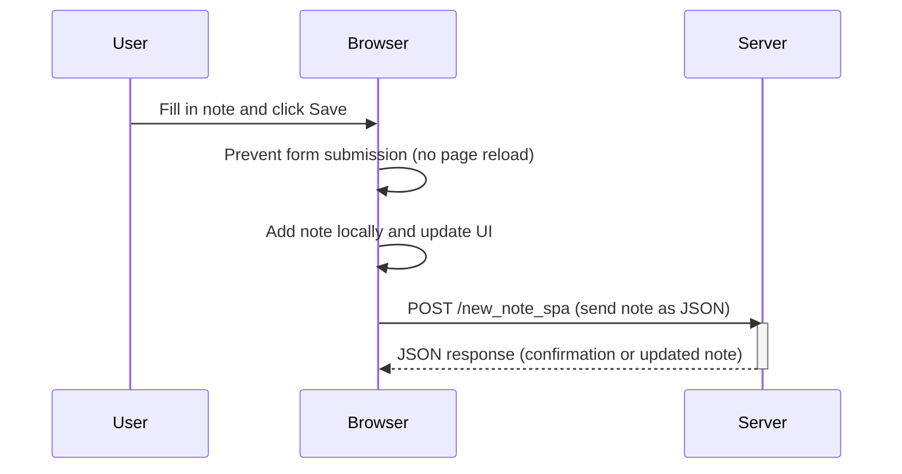

```mermaid
sequenceDiagram
    participant User
    participant Browser
    participant Server

    User->>Browser: Fill in note and click Save
    Browser->>Browser: Prevent form submission (no page reload)
    Browser->>Browser: Add note locally and update UI
    Browser->>Server: POST /new_note_spa (send note as JSON)
    activate Server
    Server-->>Browser: JSON response (confirmation or updated note)
    deactivate Server
```